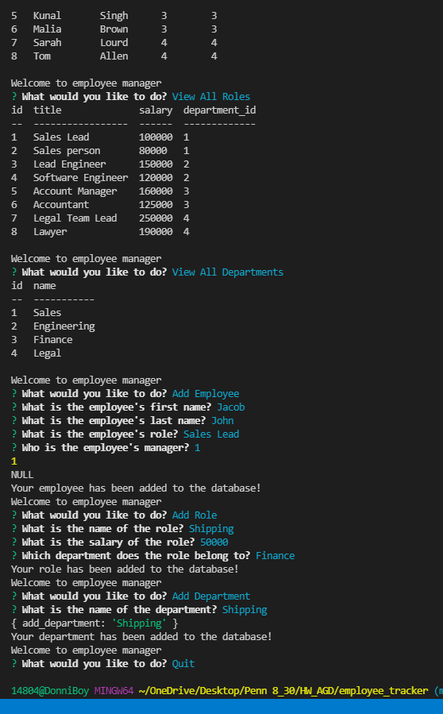

# employee_tracker

## Description
- What was your motivation? I created this project to support a large organization with its employee structure.
- Why did you build this project? To support a large organization 
- What problem does it solve? With this project a company can easily see its employees, roles, and departments. 
- What did you learn? Doing this project I was able to learn just how difficult and particular SQL is to work with. 

https://drive.google.com/file/d/1TVyllVq_jrRwR-XcD-yAj65pdsvJODKU/view
## Table of Contents
- [Installation](#installation)
- [Usage](#usage)
- [Credits](#credits)
- [License](#license)
## Installation
What are the steps required to install your project? node.js is required to run this project. open your terminal and npm i to install dependancies.

## Usage 

## License
- MIT License

Copyright (c) [2021] [Aaron Donelson]

Permission is hereby granted, free of charge, to any person obtaining a copy of this software and associated documentation files (the "Software"), to deal in the Software without restriction, including without limitation the rights to use, copy, modify, merge, publish, distribute, sublicense, and/or sell copies of the Software, and to permit persons to whom the Software is furnished to do so, subject to the following conditions:

The above copyright notice and this permission notice shall be included in all copies or substantial portions of the Software.

THE SOFTWARE IS PROVIDED "AS IS", WITHOUT WARRANTY OF ANY KIND, EXPRESS OR IMPLIED, INCLUDING BUT NOT LIMITED TO THE WARRANTIES OF MERCHANTABILITY, FITNESS FOR A PARTICULAR PURPOSE AND NONINFRINGEMENT. IN NO EVENT SHALL THE AUTHORS OR COPYRIGHT HOLDERS BE LIABLE FOR ANY CLAIM, DAMAGES OR OTHER LIABILITY, WHETHER IN AN ACTION OF CONTRACT, TORT OR OTHERWISE, ARISING FROM, OUT OF OR IN CONNECTION WITH THE SOFTWARE OR THE USE OR OTHER DEALINGS IN THE SOFTWARE.

## Badges

## Tests
